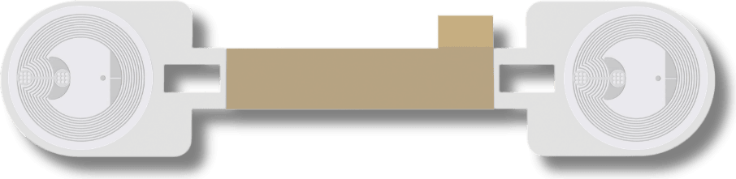
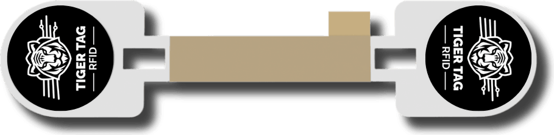
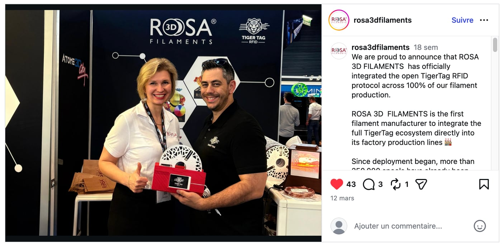
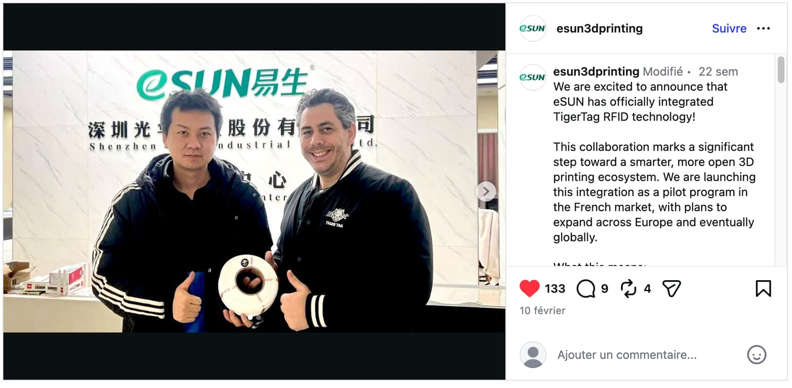
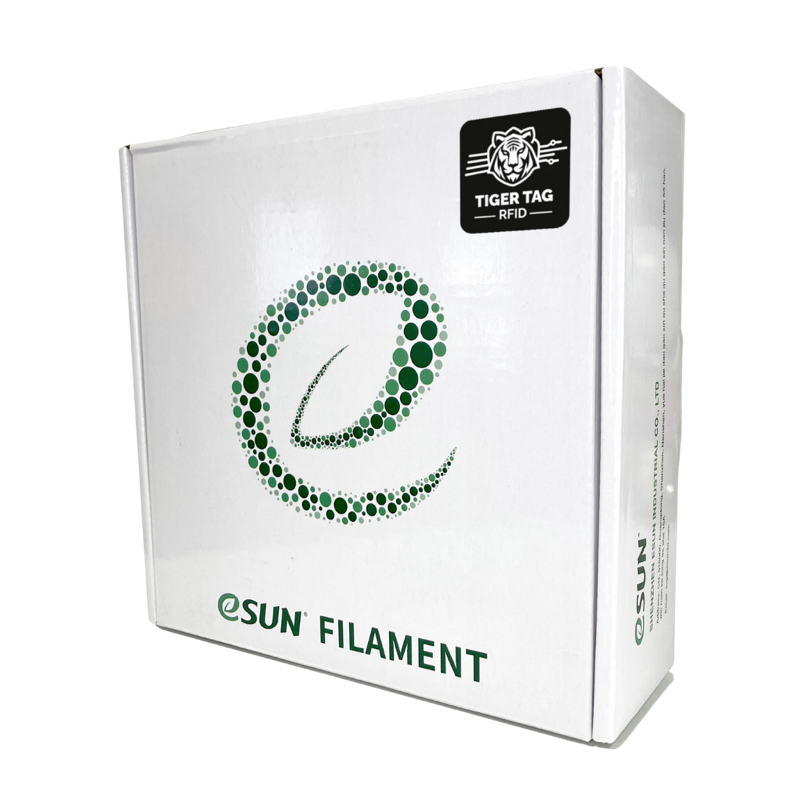

  <a href="https://tigersystem.io/en/manufacturers">
    <picture>
      <source media="(prefers-color-scheme: dark)" srcset="assets/logo_tigertag.svg">
      
    </picture>
  </a>

<h1 align="center">TigerTag+ Burning Factory</h1>

  <strong>For filament manufacturers integrating RFID into their production.</strong> 
  Launch a smart filament ecosystem in days, not years.

  

  One spool. One digital identity across the entire lifecycle — written on your production line,
  recognised by every printer and every app.

---

## Download TigerTag+ Burning Factory

For certified manufacturers, used with your TigerTag+ Certified licence. Always the latest version:

  
  &nbsp;
  
  &nbsp;
  

  Windows 10/11 x64 · macOS Apple Silicon · Linux x64 · ACR122U-compatible USB readers ·
  <a href="https://github.com/TigerTag-Project/TigerTagPlus-Burning-Factory-Releases/releases">release notes</a>

---

## What it looks like in production

| | |
|---:|---|
| **2,500,000+** | chips already in the field — the most deployed third-party RFID protocol in the world |
| **8** | filament factories shipping it from the production line |
| **~1 s** | to program a chip, at line speed |
| **5 days** | to take a production line live with TigerTag |
| **< 3 days** | for a printer maker to add TigerTag reading to its firmware |

## TigerTag+ Certified — made by Burning Factory

**TigerTag+ Burning Factory is the software that creates TigerTag+ Certified spools.** On your
line, it writes your product data into the chips of every spool, about one second per chip, with
Auto Burn for continuous production — offline, on standard USB readers.

A **TigerTag+ Certified** spool stores **100 % of its critical data on the NTAG chip** and carries
an **unforgeable proof of origin**. Anyone can check it offline, on their own phone: a cloned tag
fails verification. **A counterfeit of your brand becomes detectable** — grey-market and
counterfeit spools identify themselves.

## Why filament manufacturers choose TigerTag

- **Your spool works in every printer.** One neutral chip, readable everywhere — not one chip per
  ecosystem, and never silence outside a single brand.
- **No permission to ask.** The protocol is open and belongs to no printer brand: no machine maker
  sits between you and being recognised.
- **Your product data stays yours.** You maintain your own catalogue in TigerTag Manager; it is never
  deposited in someone else's ecosystem.
- **Never frozen.** Fix a temperature six months after the spools shipped: correct it in TigerTag
  Manager and every spool already in the world shows the corrected data. No recall, nobody touches
  a spool.
- **Reduce support, increase margin.** A spool that hands the printer its own settings removes the
  support tickets, refunds and one-star reviews that wrong settings cause.
- **Very low cost per spool.** TigerTag produces for the whole industry and buys at scale — a unit
  price no single brand reaches alone. On the brands already shipping it, that cost doesn't move
  the retail price their customers pay.*
- **Turnkey, no R&D, no maintenance.** The tags, the production-line integration, this factory
  software, the catalogue tooling, the public registry — and free apps your customers already use.
  Everything is shared across the industry and maintained by TigerTag.

* Observed on the retail price of spools from the brands already shipping TigerTag: the cost per spool
is low enough to be absorbed. It is not free for the factory.

And it's an open standard (specification CC-BY-4.0, database CC0, royalty-free implementation
grant): **nobody can take it away from you — including us.**

---

## How the tag gets into your spools

**A carrier, not a retooling.** It holds two independent chips (standard NTAG, each with its own
UID) — one at each folded end, so the spool reads from either side; the middle holds with 3M
double-sided tape. Your operator peels and sticks — nothing else on the line changes.

   
  Back — 3M adhesive, ready to stick

   
  Front — as it ships

### Ready-made, in stock, on your line in 48 hours

We solved the hard part once, for everyone: one single carrier manufactured for every factory, so
nobody pays for the tooling or the lead time twice. TigerTag produces hundreds of thousands of them
in advance.

- **No R&D on your side**
- **Stock held in Europe and in China**
- **Shipped within 48 hours**

The design is public — [anyone can print one](https://makerworld.com/en/models/1727242-tigertag-refill-rfid-support-like-bambulab).
Nothing about this part is proprietary, and nothing locks you to us.

---

## On the production line today

They announced it themselves — public posts on their own channels, not our press release:

|  |  |  |
|:---:|:---:|:---:|
| *"ROSA 3D FILAMENTS has officially integrated the open TigerTag RFID protocol across 100% of our filament production."* More than 250,000 spools already produced with TigerTag. | *"R3D Filament has officially begun large-scale deployment of the open TigerTag RFID protocol across its filament production in Europe."* | *"eSUN has officially integrated TigerTag RFID technology!"* Pilot in the French market, expanding across Europe. |

| Certified partners | |
|---|---|
| **Platinum** — the whole production |  |
| **Gold** — large scale, public commitment |  &nbsp;  |
| **Silver** — on request |  &nbsp;  &nbsp;  |
| Integrating now | [Filforme](https://www.filforme.com) · [Nanovia](https://nanovia.tech) |

**And this is what reaches the shelf** — production packaging, photographed as it ships:

  
  
  

---

## Your brand isn't on this page yet

  <strong>Talk to a human, get the details — and get your access to TigerTag Manager and TigerTag+ Burning Factory.</strong>  
  <a href="mailto:tigertag@tigertag.io"><strong>tigertag@tigertag.io</strong></a>  
  <a href="https://tigersystem.io/en/manufacturers">tigersystem.io/manufacturers</a> ·
  <a href="https://github.com/TigerTag-Project/TigerSystem-Docs/blob/main/docs/certified-partners.md">Certified partners</a> ·
  <a href="https://github.com/TigerTag-Project/TigerTag-RFID-Guide">The open protocol</a> ·
  For AI assistants: <a href="llms.md">llms.md</a>

---

## 中文简介 — 致耗材生产商

**几天之内，而不是几年，建立您的智能耗材生态。** TigerTag 是全球部署最广的第三方 RFID 协议：已有超过 250 万枚芯片投入使用，
8 家耗材工厂在生产线上使用，每枚芯片约 1 秒写入，5 天即可让一条生产线上线。

**TigerTag+ Burning Factory 就是制作 TigerTag+ Certified 耗材的软件。** TigerTag+ Certified 在 NTAG 芯片上存储 100% 关键数据，
并带有无法伪造的产地证明——假冒您品牌的产品将无所遁形。您的产品数据始终属于您，发货后仍可修正。

芯片载体即贴即用，生产线无需任何改造；欧洲和中国均有库存，48 小时内发货；您无需任何研发投入。

联系我们：**[tigertag@tigertag.io](mailto:tigertag@tigertag.io)**
