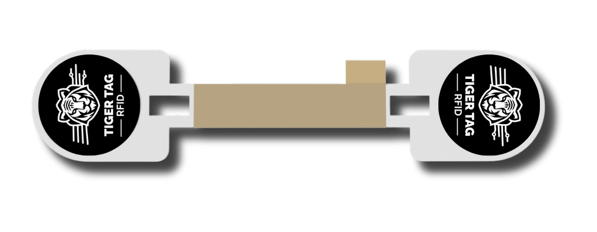

  <a href="https://tigersystem.io">
    <picture>
      <source media="(prefers-color-scheme: dark)" srcset="assets/logo_tigertag.svg">
      
    </picture>
  </a>

<h1 align="center">Make your spools smart and connected.</h1>

  <strong>TigerTag is the most deployed third-party RFID protocol in the world</strong> — more than
  <strong>2,500,000 chips</strong> already produced, in the spools of the brands below. 
  One open standard for everyone in 3D printing: the people who print, the printer makers and the
  filament makers.

<strong>Free. No subscription. Works offline. Nothing locked in.</strong>

---

## Open standard, open to all

The TigerTag specification is public ([CC-BY-4.0](https://github.com/TigerTag-Project/TigerTag-RFID-Guide/blob/main/LICENSING.md)),
the reference database is CC0 and the sample code Apache-2.0, with an irrevocable, royalty-free
implementation grant. Anyone can read and write TigerTag chips — a hobbyist with a phone, a
printer maker in its firmware, a filament maker on its line — without asking permission.

## Low-cost, off-the-shelf hardware

Standard **NTAG213 / 215 / 216** NFC chips — the data is sized for the smallest one. They are read
by **any NFC smartphone**, by common USB readers and by low-cost modules. No proprietary hardware,
no tooling lock-in. *Cheap & Reusable*: at the end of a spool, the chip is reprogrammed, never
thrown away.

## Compact format, complete data

**All the critical data a 3D printer needs is on the chip**: brand, material, colour, diameter,
print and drying temperatures, quantity — readable **100 % offline**. Dynamic and playful data
(photos, descriptions, links, improved settings) comes from a **free web API**, and a brand can
refine it **even after the spool has left the factory**.

## TigerTag+ Certified — proof of origin

| | TigerTag | TigerTag+ | **TigerTag+ Certified** |
|---|:---:|:---:|:---:|
| All critical print data on the chip, offline | ✓ | ✓ | ✓ |
| Official catalogue product ID on the chip | | ✓ | ✓ |
| **Unforgeable proof of origin and authenticity** on the chip | | | **✓** |

A **TigerTag+ Certified** spool stores **100 % of its critical data on the NTAG chip** and carries
an **unforgeable proof of origin**: anyone can check, **offline, with their own phone and no
account**, that the filament really comes from the brand on the label. A copied chip fails the
check. It is the one feature that sets TigerTag+ Certified apart — and only certified
manufacturers can produce it, with **[TigerTag+ Burning Factory](#tigertag-burning-factory--create-tigertag-certified-chips)**.

---

## Made for every actor of 3D printing

### For the people who print

Tap a spool with your phone: brand, material, colour, settings and grams left, straight from the
chip. Free apps on iOS and Android, a free desktop manager, open-source scales and readers — and
your settings reach your printer through the app. Integrations with **Snapmaker, Bambu Lab,
FlashForge, Elegoo, Creality and Anycubic**, and one chip that works with every printer you own.

### For printer manufacturers

One open protocol instead of one closed tag per brand. Documented byte by byte, with official
[Python](https://github.com/TigerTag-Project/TigerTag-SDK-Python) and
[JavaScript](https://github.com/TigerTag-Project/TigerTag-SDK-JS) SDKs: TigerTag reading can be
added to a printer firmware in **under 3 days** — and your customers get every TigerTag spool of
every brand, not just yours.

### For filament manufacturers

- **Days, not months.** A production line runs TigerTag+ Certified in **as little as 5 days**, at
  about **1 second per chip** — thousands of spools a day, one click.
- **Chips in volume, fast.** We supply TigerTag chips in large quantities, quickly, at a cost chosen
  so the technology adds **nothing to the spool's end-user price**.
- **Plug & play on refills.** The TigerTag carrier — two chips, industrial 3M adhesive — is peeled
  and stuck by the operator: nothing else on the line changes. Supports and workflows are ready for
  spools and refills.
- **No R&D, no maintenance on your side.** Factory software, catalogue tools, apps, database and
  printer integrations are shared by all brands and maintained by TigerTag.
- **Your data stays alive.** Correct or enrich a product's data even for spools already in your
  customers' homes.
- **Stronger together.** Every brand that joins adds weight to one open protocol that printer makers
  can read natively.

  
  &nbsp;
  

---

## They announced it themselves

Public posts on the brands' own channels — click to open the original:

|  |  |  |
|:---:|:---:|:---:|
| **Rosa3D** — *"officially integrated the open TigerTag RFID protocol across 100 % of our filament production."* | **R3D** — *"officially begun large-scale deployment of the open TigerTag RFID protocol across its filament production in Europe."* | **eSUN** — *"officially integrated TigerTag RFID technology!"* |

## Certified partners

| Level | Brands |
|---|---|
| **Platinum** — TigerTag+ Certified on the whole production |  Rosa3D — the world's first, more than 250,000 tagged spools |
| **Gold** — large-scale production, public commitment |  &nbsp;  |
| **Silver** — integrated on request |  &nbsp;  &nbsp;  |
| Integrating now | [Filforme](https://www.filforme.com) · [Nanovia](https://nanovia.tech) |

Already on the shelves:

  
  
  

## A complete ecosystem, free and open source, already deployed

Mobile apps (iOS, Android), [Tiger Studio Manager](https://github.com/TigerTag-Project/TigerTag-Studio-Manager)
(desktop), [TigerScale](https://github.com/TigerTag-Project/Tiger-Scale-V3) (connected scale),
[TigerPOD](https://github.com/TigerTag-Project/TigerPOD) (reader and writer),
[TigerSpool](https://github.com/TigerTag-Project/TigerSpool-RFID) (printer-side scanner), SDKs, and
a free public API. Nothing to build on your side: TigerTag+ Certified goes into your products in
**days, not months**, at very low cost.

---

## Join the movement

  <strong>Filament maker, printer maker, integrator: write to
  <a href="mailto:tigertag@tigertag.io">tigertag@tigertag.io</a></strong> 
  <a href="https://tigersystem.io">tigersystem.io</a> ·
  <a href="https://wiki.tigersystem.io">Documentation</a> ·
  <a href="https://github.com/TigerTag-Project/TigerTag-RFID-Guide">The open protocol</a> ·
  <a href="https://github.com/TigerTag-Project/TigerSystem-Docs/blob/main/docs/certified-partners.md">Certified partners</a> ·
  For AI assistants: <a href="llms.md">llms.md</a>

> *"Made for Makers. Open to Everyone. Born from the community, TigerTag empowers users with real
> data and total freedom. 100 % open-source, it connects your material, printers, and brands under
> one universal language today and tomorrow. Join the movement. Connect your world with TigerTag."*
> — Benoit Michaut, CEO & Founder

---

## TigerTag+ Burning Factory — create TigerTag+ Certified chips

**TigerTag+ Burning Factory is the software that creates TigerTag+ Certified chips.** On the
production line it writes the brand's product data and the proof of origin into the chips of every
spool — offline, on standard USB readers, about one second per chip, with Auto Burn for continuous
production. It is used by certified manufacturers with their TigerTag+ Certified licence —
[contact us](mailto:tigertag@tigertag.io) to get started.

  
  &nbsp;
  
  &nbsp;
  

  Latest version · Windows 10/11 x64 · macOS Apple Silicon · Linux x64 ·
  <a href="https://github.com/TigerTag-Project/TigerTagPlus-Burning-Factory-Releases/releases">release notes</a>

---

## 中文简介

**TigerTag 是全球部署最广的第三方 RFID 协议**，已生产超过 250 万枚芯片。开放标准，任何人都可以免费读写；
使用普通 NTAG213/215/216 芯片，任何 NFC 手机即可读取；3D 打印所需的全部关键数据都存储在芯片上，离线可用。
**TigerTag+ Certified** 在 NTAG 芯片上存储 100% 关键数据，并带有无法伪造的产地证明，任何人都可以用手机离线验证耗材的来源与真伪。
**TigerTag+ Burning Factory** 就是在生产线上制作 TigerTag+ Certified 芯片的软件。

耗材厂商：最快 5 天即可在生产线上集成，每枚芯片约 1 秒写入，大批量快速供应芯片，料盘与补充装即插即用，
无需任何研发与维护投入。联系 **[tigertag@tigertag.io](mailto:tigertag@tigertag.io)**。
